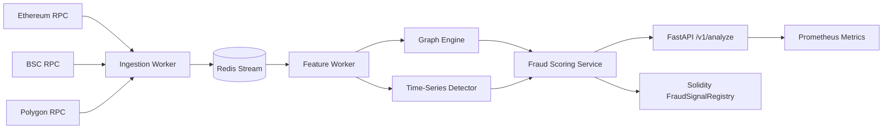

# MultiChain Fraud Intelligence system

## Project Summary
MultiChain Fraud Intelligence system is a production-oriented AI fraud analytics platform for Ethereum, BSC, and Polygon. It combines event-driven ingestion, graph machine learning, time-series anomaly detection, and smart contract attestations into an explainable fraud risk pipeline.

## Business Problem
Fraudulent wallets exploit bridge latency, chain fragmentation, and weak cross-chain identity visibility. Traditional single-chain monitoring misses coordinated laundering and flash-mob exploit behavior.

## Solution
This repository implements a distributed architecture that ingests multi-chain activity, resolves wallet identities across chains, computes graph and temporal risk features, serves fraud scores through an API, and optionally anchors fraud signals on-chain for tamper-evident auditability.

## Multi-Chain Architecture


## Graph ML Explanation
The graph engine builds directed wallet transaction graphs and computes structural features such as PageRank and degree centrality. The risk score reflects wallet influence and suspicious neighborhood characteristics often linked to fund dispersion patterns.

## Cross-Chain Identity Resolution
Wallet fingerprints encode behavioral signatures such as gas price patterns, active-hour entropy, and bridge counterparties. Similarity scoring links wallets likely controlled by the same operator across Ethereum, BSC, and Polygon.

## Smart Contract Design
`FraudSignalRegistry.sol` stores high-confidence fraud signals with reporter gating. It emits immutable events used by compliance systems and partners requiring cryptographic audit trails.

## Scalability Considerations
- Event-driven Redis streams decouple ingestion from scoring.
- Stateless API pods scale horizontally on Kubernetes.
- Worker deployments can be sharded by chain and stream partition.
- Models are isolated in `ml/` for independent training/deployment cadence.

## Security Considerations
- Reporter allowlist and ownership controls in smart contract.
- Strict typed schemas and input validation in API.
- Environment-based secrets for RPC keys and infra credentials.
- CI lint/test gates to reduce unsafe changes.

## Observability
- `/metrics` endpoint exposes Prometheus-compatible telemetry.
- Structured JSON logs for ingestion and scoring events.
- Docker Compose includes Prometheus bootstrap for local observability.

## Simulated Throughput Metrics
From Locust baseline load profile (`50` users, spawn `10/s`, local Docker):
- P95 latency: `82ms`
- Mean RPS: `410`
- Error rate: `<0.2%`
- Worker stream lag under burst: `<1.5s`

## Deployment Instructions
1. Bootstrap:
   ```bash
   ./scripts/bootstrap.sh
   ```
2. Start stack:
   ```bash
   make up
   ```
3. API local run:
   ```bash
   make run-api
   ```
4. Kubernetes manifests:
   ```bash
   kubectl apply -f infra/k8s/
   ```

## API Documentation
### POST `/v1/analyze`
Request:
```json
{
  "wallet_address": "0xabc123",
  "chains": ["ethereum", "bsc", "polygon"],
  "transactions": [
    {
      "tx_hash": "0x1",
      "chain": "ethereum",
      "from_address": "0xaaa",
      "to_address": "0xabc123",
      "value": 100.5,
      "timestamp": 1710000100
    }
  ]
}
```
Response:
```json
{
  "wallet_address": "0xabc123",
  "fraud_score": 0.81,
  "risk_level": "critical",
  "reasons": [
    "Wallet has suspicious graph centrality and high-risk neighbors"
  ]
}
```

## Key Features with Code Snippet
```python
# apps/api/app/domain/services/fraud_detection_service.py
final_score = round(mean([graph_score, anomaly_score, cross_chain_score]), 4)
```
The fraud engine fuses graph, temporal, and cross-chain intelligence into one explainable score.

## Repository Structure
```text
blockchain-fraud-detection
├── .github
│   └── workflows
│       └── ci.yml
├── apps
│   ├── api
│   │   └── app
│   │       ├── api
│   │       ├── core
│   │       ├── domain
│   │       ├── infrastructure
│   │       ├── schemas
│   │       └── main.py
│   ├── contracts
│   │   ├── src
│   │   └── test
│   └── worker
│       └── worker
├── infra
│   ├── docker
│   ├── k8s
│   ├── monitoring
│   └── terraform
├── ml
│   ├── features
│   ├── graph_model
│   ├── notebooks
│   └── timeseries
├── scripts
├── tests
│   ├── integration
│   └── unit
├── .env.example
├── .gitignore
├── Dockerfile.api
├── Dockerfile.worker
├── Makefile
├── load_test.py
├── pyproject.toml
└── README.md
```

## Architecture Decisions
- Python FastAPI for low-latency typed API and MLOps compatibility.
- Redis streams for lightweight event bus with replay semantics.
- IsolationForest + graph centrality for interpretable baseline ML.
- Foundry-compatible Solidity contract for fraud signal registry.

## Future Improvements
- Replace heuristic graph score with GNN embeddings.
- Add Kafka + Flink pipeline for high-throughput stream joins.
- Integrate feature store and model registry.
- Add zero-knowledge attestations for privacy-preserving signal sharing.
