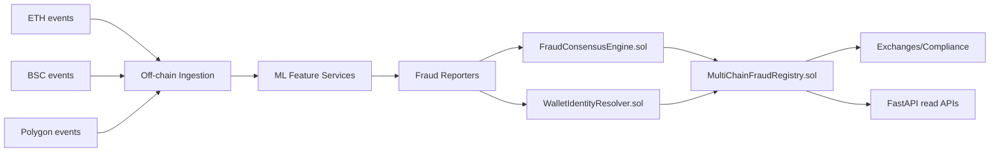

# MultiChain Fraud Intelligence system

Solidity-first multi-chain fraud intelligence stack for Ethereum, BSC, and Polygon with on-chain consensus, wallet identity graphing, and anchored risk attestations.

## Project Summary
This repository is designed like a blockchain analytics startup platform where the core fraud intelligence lifecycle is executed on-chain. Fraud reporters submit weighted votes, consensus is finalized in Solidity, cross-chain wallet identities are resolved on-chain, and finalized fraud signals are immutably anchored for downstream compliance and exchange risk controls.

## Business Problem
Fraud rings coordinate exploits and laundering paths across chains. Off-chain only detection systems suffer from trust gaps, unverifiable scoring logic, and fragmented risk signals across infrastructure partners.

## Solution
A mostly-Solidity system where fraud decisions and attestations are governed by smart contracts:
- `FraudConsensusEngine`: weighted voting from approved reporters
- `WalletIdentityResolver`: cross-chain cluster resolution
- `MultiChainFraudRegistry`: immutable anchoring of finalized signals
- `FraudSignalRegistry`: lightweight legacy attestation interface

Python services remain as adapters for ingestion, ML feature extraction, and API access.

## Multi-Chain Architecture


## Graph ML Explanation
Graph ML extracts suspicious wallet topology and flow patterns off-chain. Reporters submit model-backed scores on-chain with confidence weights. Consensus score is derived by Solidity weighted averaging to guarantee deterministic verification.

## Cross-Chain Identity Resolution
`WalletIdentityResolver` links wallets into fraud clusters (`clusterId`) across chain IDs, including confidence scores. Anchored fraud records carry the cluster ID so downstream consumers can block related wallets, not just a single address.

## Smart Contract Design
### Core contracts
- `ReporterRegistry.sol`: owner-managed reporter allowlist
- `FraudConsensusEngine.sol`: weighted vote aggregation and quorum finalization
- `WalletIdentityResolver.sol`: chain-aware wallet clustering
- `MultiChainFraudRegistry.sol`: final signal anchor with identity context
- `FraudSignalRegistry.sol`: simple compatibility registry

### Solidity snippet
```solidity
st.totalWeight += confidenceBps;
st.weightedScoreSum += uint256(scoreBps) * confidenceBps;
if (st.totalWeight >= quorumWeight) {
    _finalize(signalId, st);
}
```

## Scalability Considerations
- Reporter horizontal scale with stake-based governance extensions
- Multi-chain shards by `chainId` and signal namespace
- Stateless off-chain services; immutable on-chain canonical state
- Batching reporter commits for gas-optimized anchoring

## Security Considerations
- Strict reporter authorization with owner-controlled rotation
- Quorum-based finalization to reduce single-reporter manipulation
- Confidence-weighted vote aggregation with bounded bps checks
- Immutable on-chain audit trail for post-incident forensics

## Observability
- Contract event streams (`VoteSubmitted`, `SignalFinalized`, `SignalAnchored`)
- API metrics endpoint for adapter performance
- Prometheus + structured logs in Docker stack

## Simulated Throughput Metrics
Local simulation target profile:
- Reporter votes: 150 tx/minute
- Finalization latency: < 2 blocks after quorum
- Anchor writes: 30 tx/minute
- API p95: < 100ms for read paths

## Deployment Instructions
### Contracts
```bash
cd apps/contracts
forge build
forge test -vv
forge script script/Deploy.s.sol:Deploy --rpc-url $RPC_URL --broadcast
```

### Full stack
```bash
./scripts/bootstrap.sh
make up
```

## API Documentation
### POST `/v1/analyze`
Accepts wallet + transaction payload and returns explainable fraud score.

### GET `/v1/health`
Service health probe.

### GET `/metrics`
Prometheus scrape endpoint.

## Repository Structure
```text
blockchain-fraud-detection
├── apps
│   ├── contracts
│   │   ├── src
│   │   │   ├── access
│   │   │   ├── core
│   │   │   ├── interfaces
│   │   │   └── libraries
│   │   ├── script
│   │   └── test
│   ├── api
│   └── worker
├── infra
├── ml
├── tests
├── Makefile
├── load_test.py
└── README.md
```

## Future Improvements
- Add staking/slashing for malicious reporters
- Add optimistic fraud proofs and challenge windows
- Add zk-attested reporter model outputs
- Integrate L2 settlement and calldata compression
