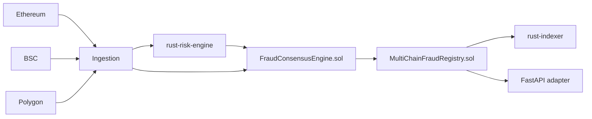

# MultiChain Fraud Intelligence system

Solidity-first and Rust-accelerated multi-chain fraud intelligence stack for Ethereum, BSC, and Polygon.

## Project Summary
This repository models a startup-grade fraud platform where canonical risk consensus and identity linkage are on-chain, while low-latency scoring and indexing are handled by Rust services and Python adapters.

## Business Problem
Fraud campaigns distribute activity across chains and wallets. Pure off-chain systems lack shared trust guarantees and often create inconsistent partner risk decisions.

## Solution
- Solidity contracts finalize fraud consensus and anchor immutable signals
- Rust risk engine computes deterministic weighted fraud score artifacts
- Rust indexer ingests anchored signal events for compliance/search pipelines
- Python API/worker acts as integration adapter for ingestion and ML feature prep

## Multi-Chain Architecture


## Graph ML Explanation
Graph and temporal features are computed off-chain, then transformed into reporter votes. The Rust risk engine provides reproducible scoring logic before publishing scores to Solidity consensus.

## Cross-Chain Identity Resolution
`WalletIdentityResolver.sol` maps `(chainId, wallet)` to cluster identities, enabling signal propagation to related addresses across chains.

## Smart Contract Design
- `ReporterRegistry.sol`
- `FraudConsensusEngine.sol`
- `WalletIdentityResolver.sol`
- `MultiChainFraudRegistry.sol`
- `FraudSignalRegistry.sol`

## Scalability Considerations
- Solidity contracts are minimal and event-centric
- Rust services support high-throughput event decoding/scoring
- Python services remain stateless and horizontally scalable

## Security Considerations
- Reporter allowlist and ownership controls
- Quorum-weighted voting with bounded score math
- Immutable anchoring and event replay

## Observability
- Contract events for every vote/finalization/anchor
- Prometheus endpoint in API adapter
- Rust service logs for scoring/indexing pipelines

## Simulated Throughput Metrics
- 150 reporter votes/minute
- <2-block finalization after quorum
- Rust indexing throughput target: 4k events/sec per instance

## Deployment Instructions
### Contracts
```bash
cd apps/contracts
forge build
forge test -vv
forge script script/Deploy.s.sol:Deploy --rpc-url $RPC_URL --broadcast
```

### Rust
```bash
cargo test --workspace
make rust-run-risk
make rust-run-indexer
```

### Full stack
```bash
./scripts/bootstrap.sh
make up
```

## API Documentation
- `POST /v1/analyze`
- `GET /v1/health`
- `GET /metrics`

## Repository Structure
```text
blockchain-fraud-detection
├── .github
│   └── workflows
│       └── ci.yml
├── apps
│   ├── api
│   │   └── app
│   │       ├── api
│   │       │   ├── __init__.py
│   │       │   └── routes.py
│   │       ├── core
│   │       │   ├── __init__.py
│   │       │   ├── config.py
│   │       │   └── logging.py
│   │       ├── domain
│   │       │   ├── entities
│   │       │   │   ├── __init__.py
│   │       │   │   └── transaction.py
│   │       │   ├── repositories
│   │       │   │   └── __init__.py
│   │       │   ├── services
│   │       │   │   ├── __init__.py
│   │       │   │   └── fraud_detection_service.py
│   │       │   └── __init__.py
│   │       ├── infrastructure
│   │       │   ├── chains
│   │       │   │   ├── __init__.py
│   │       │   │   └── rpc_client.py
│   │       │   ├── graph
│   │       │   │   ├── __init__.py
│   │       │   │   └── wallet_graph_engine.py
│   │       │   ├── ingestion
│   │       │   │   ├── __init__.py
│   │       │   │   └── event_consumer.py
│   │       │   ├── timeseries
│   │       │   │   ├── __init__.py
│   │       │   │   └── anomaly_detector.py
│   │       │   └── __init__.py
│   │       ├── schemas
│   │       │   ├── __init__.py
│   │       │   └── fraud.py
│   │       ├── __init__.py
│   │       └── main.py
│   ├── contracts
│   │   ├── script
│   │   │   └── Deploy.s.sol
│   │   ├── src
│   │   │   ├── access
│   │   │   │   └── Ownable.sol
│   │   │   ├── core
│   │   │   │   ├── FraudConsensusEngine.sol
│   │   │   │   ├── MultiChainFraudRegistry.sol
│   │   │   │   ├── ReporterRegistry.sol
│   │   │   │   └── WalletIdentityResolver.sol
│   │   │   ├── interfaces
│   │   │   │   ├── IFraudConsensusEngine.sol
│   │   │   │   └── IWalletIdentityResolver.sol
│   │   │   ├── libraries
│   │   │   │   ├── RiskMath.sol
│   │   │   │   └── Types.sol
│   │   │   └── FraudSignalRegistry.sol
│   │   ├── test
│   │   │   ├── core
│   │   │   │   ├── FraudConsensusEngine.t.sol
│   │   │   │   └── MultiChainFraudRegistry.t.sol
│   │   │   └── FraudSignalRegistry.t.sol
│   │   └── foundry.toml
│   ├── rust-indexer
│   │   ├── src
│   │   │   └── main.rs
│   │   └── Cargo.toml
│   ├── rust-risk-engine
│   │   ├── src
│   │   │   ├── lib.rs
│   │   │   └── main.rs
│   │   ├── tests
│   │   │   └── integration.rs
│   │   └── Cargo.toml
│   └── worker
│       └── worker
│           ├── connectors
│           │   ├── __init__.py
│           │   └── stream.py
│           ├── core
│           │   ├── __init__.py
│           │   └── config.py
│           ├── jobs
│           │   ├── __init__.py
│           │   └── ingest_job.py
│           ├── __init__.py
│           └── main.py
├── infra
│   ├── docker
│   │   └── docker-compose.yml
│   ├── k8s
│   │   ├── api-deployment.yaml
│   │   └── worker-deployment.yaml
│   ├── monitoring
│   │   └── prometheus.yml
│   └── terraform
│       └── main.tf
├── ml
│   ├── features
│   │   └── cross_chain_identity.py
│   ├── graph_model
│   │   └── train_graph_model.py
│   ├── notebooks
│   │   └── .gitkeep
│   └── timeseries
│       └── train_timeseries_model.py
├── scripts
│   └── bootstrap.sh
├── tests
│   ├── integration
│   │   └── test_health_endpoint.py
│   └── unit
│       ├── test_fraud_detection.py
│       └── test_wallet_graph_engine.py
├── .env.example
├── .gitignore
├── .gitkeep
├── Cargo.toml
├── Dockerfile.api
├── Dockerfile.worker
├── Makefile
├── README.md
├── load_test.py
└── pyproject.toml
```

## Future Improvements
- Add slashing-enabled reporter staking
- Add Rust gRPC index/query plane
- Add zero-knowledge reporter attestations
